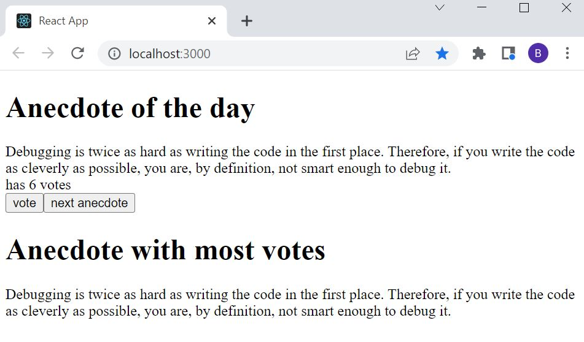

# Part 1: Introduction to React, anecdotes

The application generates random anecdotes from the field of software engineering when a button is clicked

## anecdotes

## Run 
- `npm start`
Runs the app in the development mode. 
Open [http://localhost:3000](http://localhost:3000) to view it in the browser.