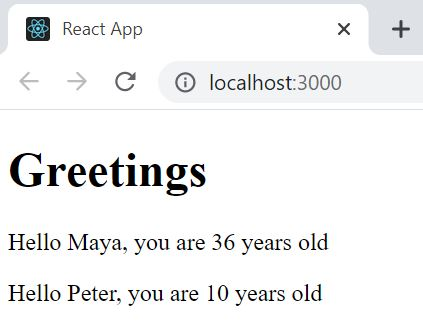

# Part 1: Following course

This application was obtained by following the examples in part 1 of sections c) Component state, event handlers

## following course

## Run 
- `npm start`
Runs the app in the development mode. 
Open [http://localhost:3000](http://localhost:3000) to view it in the browser.