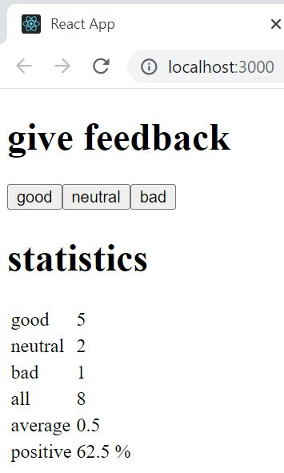

# Part 1: Introduction to React, unicafe

This application is used to collect feedback from customers of a coffee shop. Comments are displayed using statistics.

Here are the additional concepts that have been put into practice:

Destructing. Stateful component. Event handling.

## unicafe

## Run 
- `npm start`
Runs the app in the development mode. 
Open [http://localhost:3000](http://localhost:3000) to view it in the browser.