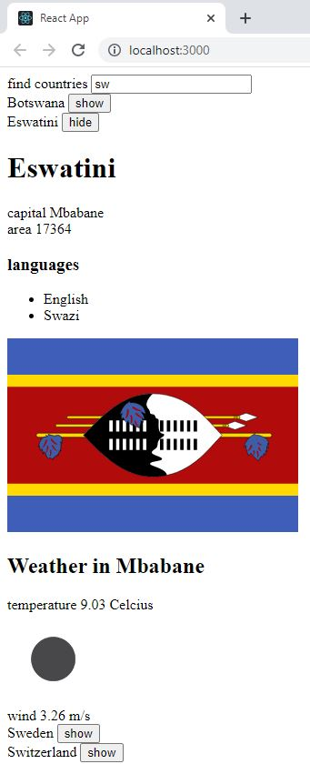

# Part 2: Communicating with server, countriesinfo

This application allows you to search various countries. The country to be shown is found by typing a search query into the search field.

## countriesinfo
- If there are too many (over 10) countries that match the query, then the user is prompted to make their query more specific:

    

- If there are ten or fewer countries, but more than one, then all countries matching the query are shown:

    

There is a button next to the name of the country, which when pressed shows the view for that country:
    

To display the weather, the weather https://openweathermap.org API is used. (Please refer to TODO: Configuration section)   

- If there is only one country matching the query, then the basic data of the country are shown:

    

- If there is none of the country matching the query:
    
    

## TODO: Configuration 
Need to configure environment variable using .env file:

    

    # .env
    REACT_APP_API_KEY=[Enter API key]

## Run 
- `npm start`
Runs the app in the development mode. 
Open [http://localhost:3000](http://localhost:3000) to view it in the browser.

- `npm run server`
Runs the json server. 
Open [http://localhost:3001/persons](http://localhost:3001/persons) to view the persons stored in the database.
