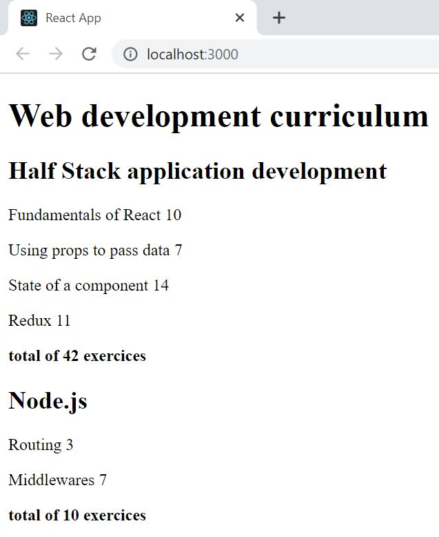

# Part 2: Communicating with server, courseinfo

This application displays the information of multiple courses. More precisely, the name of the section and the number of exercises.

## courseinfo
    

## Run 
- `npm start`
Runs the app in the development mode. 
Open [http://localhost:3000](http://localhost:3000) to view it in the browser.