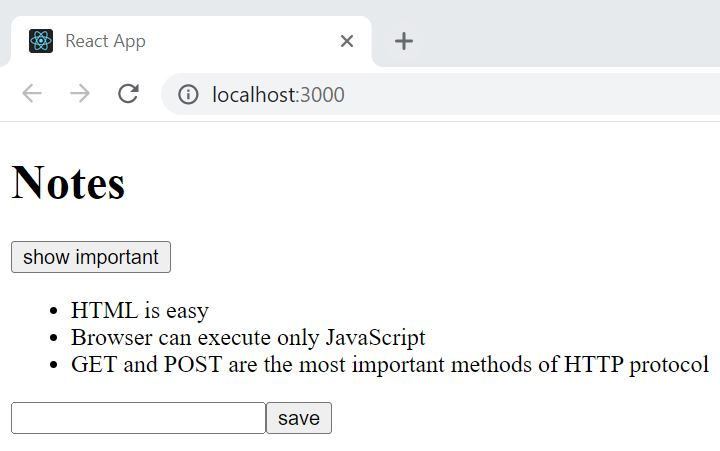

# Part 2: Following course

This application displays notes.

This iteration allows you to add notes that are not saved by a server.

This app was used for learning forms.

## following course b) Forms

## Run 
- `npm start`
Runs the app in the development mode. 
Open [http://localhost:3000](http://localhost:3000) to view it in the browser.