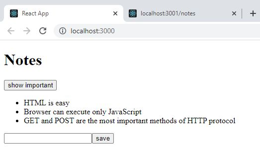
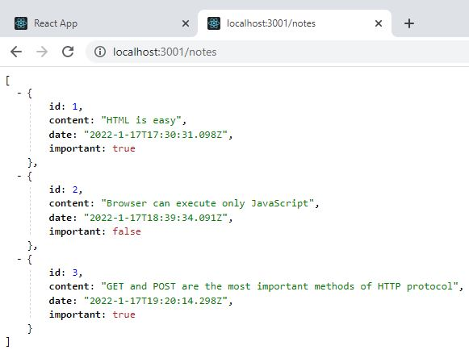

# Notes app# Part 2: Following course

This application displays notes. The data is retrieved from the server.

## following course c) Getting data from server

This application uses json-server to store all data in db.json file.

## Run 
- `npm start`
Runs the app in the development mode. 
Open [http://localhost:3000](http://localhost:3000) to view it in the browser.

- `npm run server`
Runs the json server. 
Open [http://localhost:3001/persons](http://localhost:3001/notes) to view the persons stored in the database.