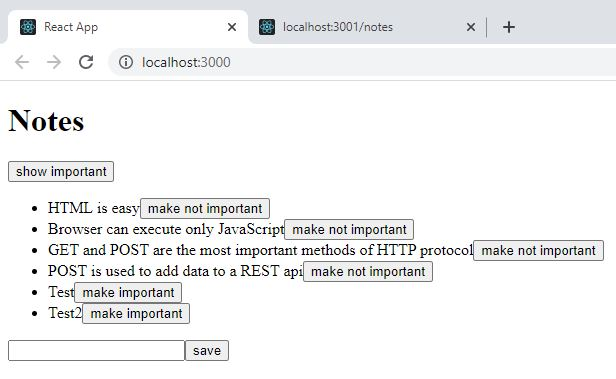
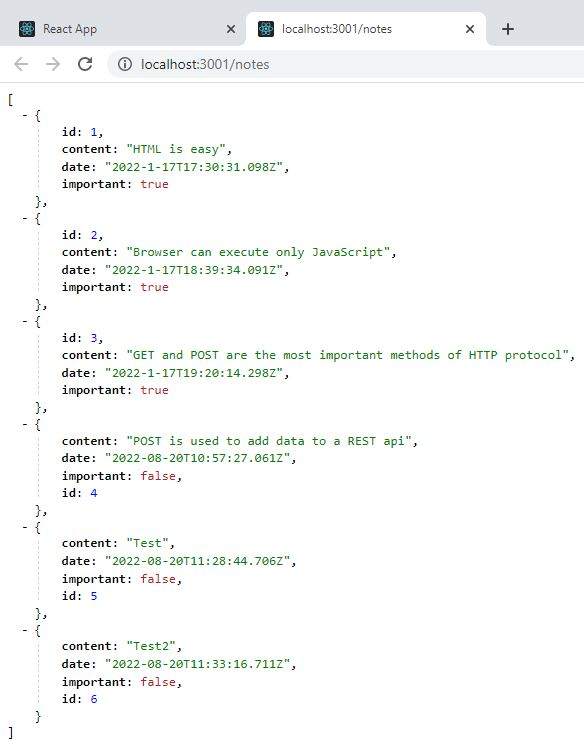
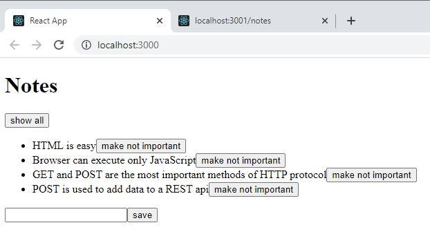

# Notes app# Part 2: Following course

This application displays notes. The data is extracted and saved in the server. A button has been added to each note so it can be used to toggle its importance.

## following course d) Altering data in server

This application uses json-server to store all data in db.json file.

By clicking the 'show importance' button, only important notes are displayed.

## Run 
- `npm start`
Runs the app in the development mode. 
Open [http://localhost:3000](http://localhost:3000) to view it in the browser.

- `npm run server`
Runs the json server. 
Open [http://localhost:3001/persons](http://localhost:3001/notes) to view the persons stored in the database.