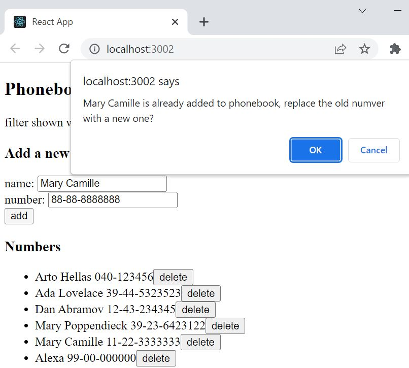

# Part 2: Communicating with server, phonebook

This application allows you to manage a phonebook: addition, modification, deletion and filter of a contact.

## phonebook

# Operations
- Add new person:

    

- Modify person:

    

    

- Delete person:

    

    

- Filter person by name:

    

# Others

This application uses json-server to store all data in db.json file. 
    

This application also handle some exception. If you delete a person in browser 1 a short while before attempting to change the person's phone number in browser 2, you will get a error message.
    
    

## Run 
- `npm start`
Runs the app in the development mode. 
Open [http://localhost:3000](http://localhost:3000) to view it in the browser.

- `npm run server`
Runs the json server. 
Open [http://localhost:3001/persons](http://localhost:3001/persons) to view the persons stored in the database.