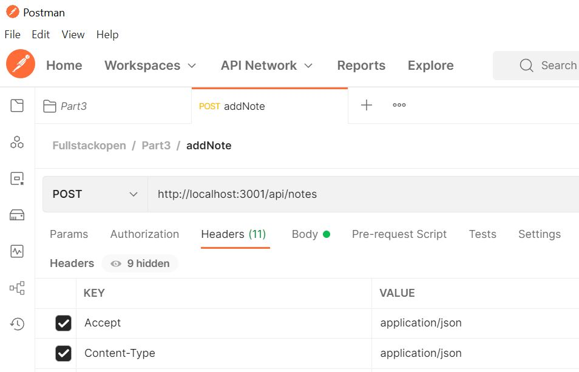
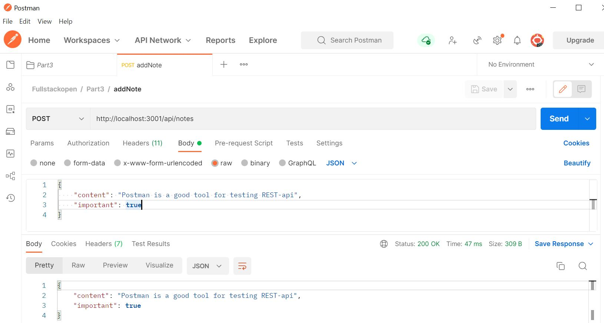
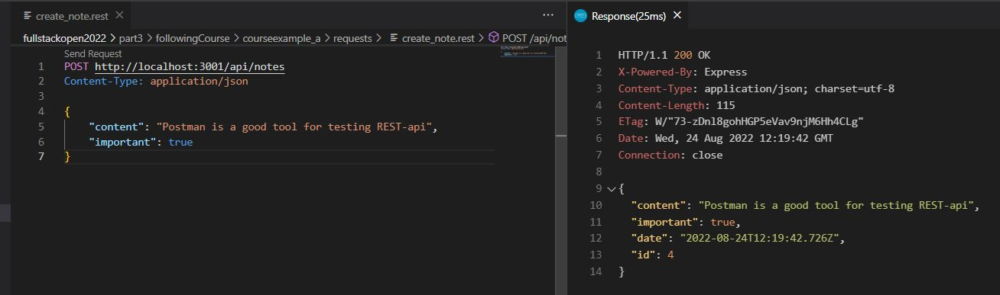

# Notes app# Part 3: Following course

## following course a) Node.js and Express
This backend server in Node returns notes using the Express library which provides an interface to work with the built-in http module. 

Nodemon is use to automatically reload the server after a change is made.

This application provides a CRUD API (resource oriented architecture). 

These are the possible requests: 
- Fetch all notes/resources: GET http://localhost:3001/api/notes
- Fetch a single note/resource: GET http://localhost:3001/api/notes/[insert id]
- Delete a note/resource: DELETE http://localhost:3001/api/notes/[insert id]
- Adding a note resource: POST http://localhost:3001/api/notes
    Content-Type: application/json
    {
        "content": "Postman is a good tool for testing REST-api",
        "important": true
    }

## Tools to test API
These tools allow to test HTTP requests

### - Postman 
Example POST request: 

### - Visual Studio Code REST client plugin 
Main advantage: available at the root of the project repository, and requests can be distributed to everyone in the development team

Example POST request: 

## Run 
- `npm start`
Runs the node server 
Open [http://localhost:3001/api/notes](http://localhost:3001/api/notes) to view all the notes in the server using the browser.

- `npm run server`
Run the server in the development mode using Nodemon 
Open [http://localhost:3001/api/notes](http://localhost:3001/api/notes) to view all the notes in the server using the browser.

