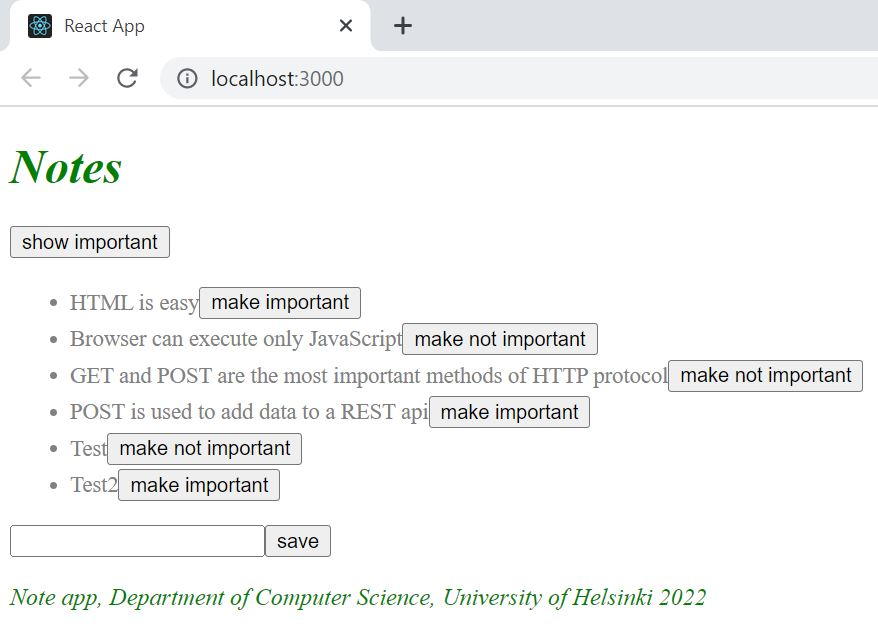

# Notes app# Part 2: Following course

This application displays notes. The data is extracted and saved in the server. A button has been added to each note so it can be used to toggle its importance. 

This section teaches the basics of adding styles to a React application.

## following course e) Adding styles to React app

## Run 
- `npm start`
Runs the app in the development mode. 
Open [http://localhost:3000](http://localhost:3000) to view it in the browser.

- `npm run server`
Runs the json server. 
Open [http://localhost:3001/persons](http://localhost:3001/notes) to view the persons stored in the database.