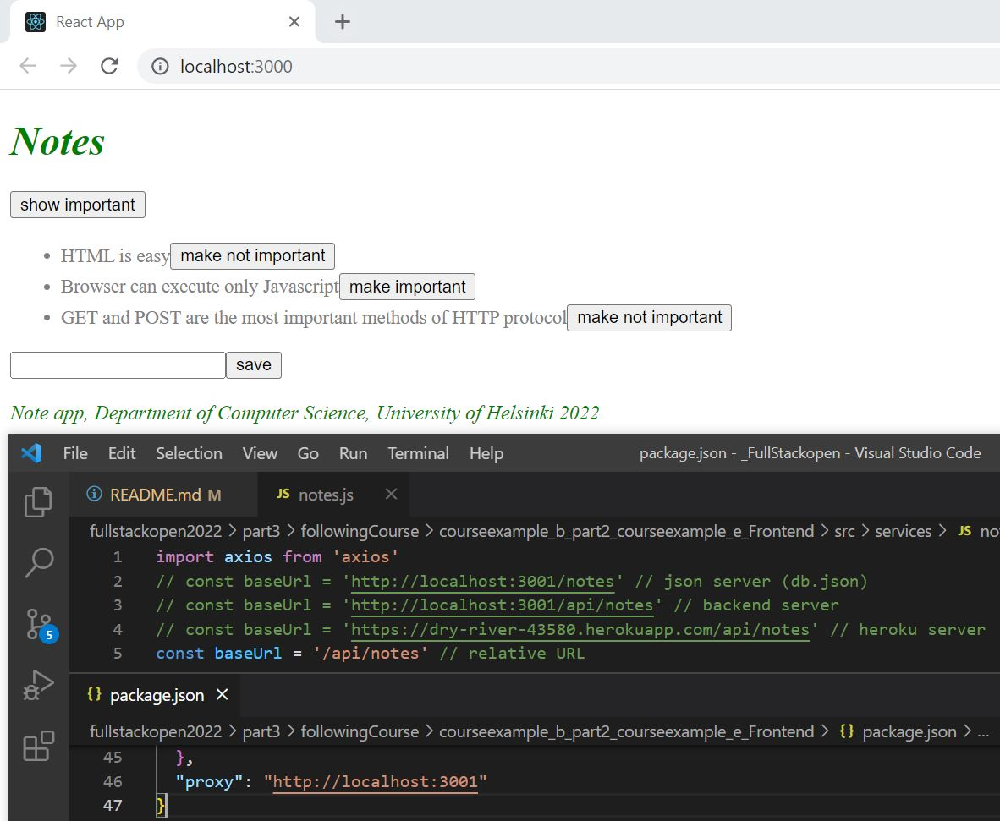

# Notes app# Part 3: Following course

## following course b) Deploying app to internet
This frontend application communicates with the backend server (Heroku server) to display notes.

This section teaches how to do a production build of an application created with create-react-app.
This section also teaches how to add a proxy so that the frontend application works in development and production mode.

## Run 
- `npm start`
Runs the app in the development mode. 
Open [http://localhost:3000](http://localhost:3000) to view it in the browser.

## This project contains two sections:
### BE
- https://github.com/baotranC/fullstackopen2022_part3_followingCourse_BE
### FE
- https://github.com/baotranC/fullstackopen2022/tree/main/part3/followingCourse/courseexample_b_part2_courseexample_e_Frontend