# Part 3: Programming a server with NodeJS and Express

## phonebook

This frontend application communicates with the backend server (Heroku server) to manage a phonebook: addition, modification, deletion and filter of a contact. Field validation is also done.

This section teaches how to do a production build of an application created with create-react-app.
This section also teaches how to add a proxy so that the frontend application works in development and production mode.

## Run 
- `npm start`
Runs the app in the development mode. 
Open [http://localhost:3002](http://localhost:3002) after running the backend server to view the app in the browser.

## This project contains two sections:
### BE
https://github.com/baotranC/fullstackopen2022_part3_BE
### FE
https://github.com/baotranC/fullstackopen2022/tree/main/part3/phonebook_part2_Frontend

## Application: phonebook

### Add a person

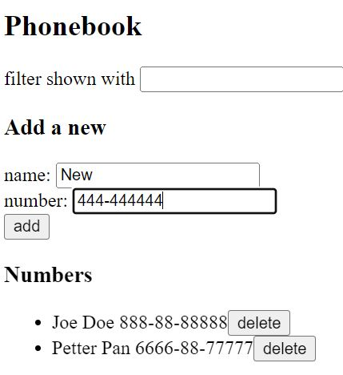 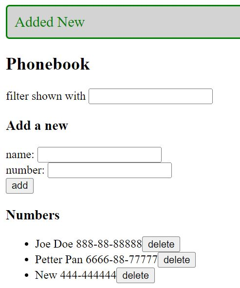

### Modify a person

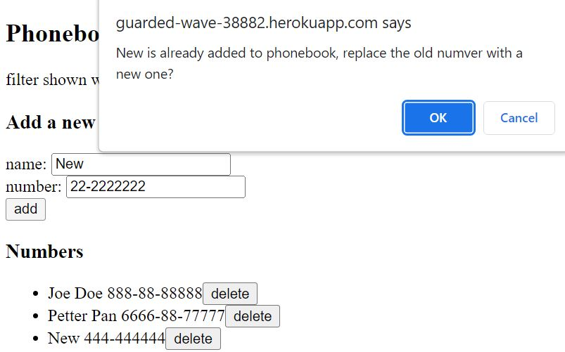 

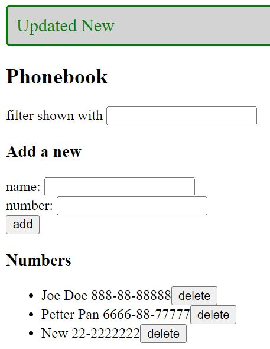

### Delete a person

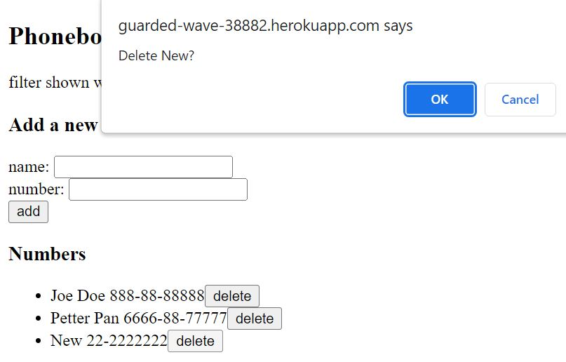 

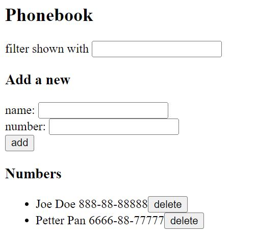

### Applly filter

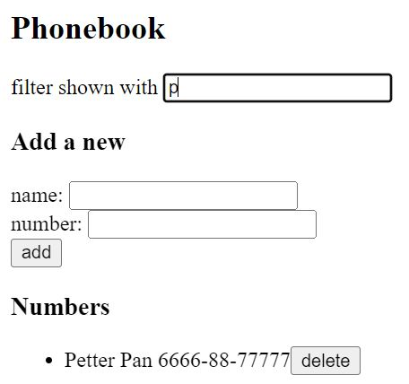

## Validations: phonebook

### Field missing

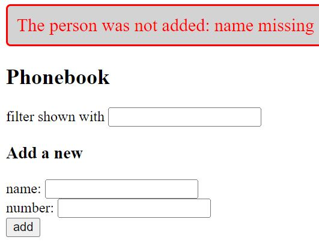 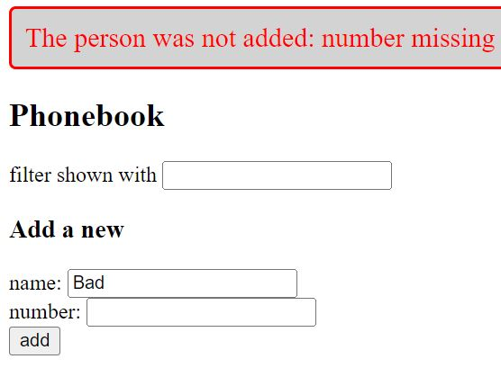

### Not a valid phone number

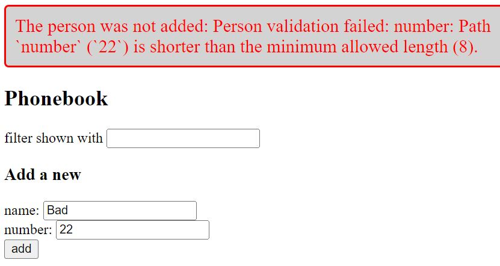 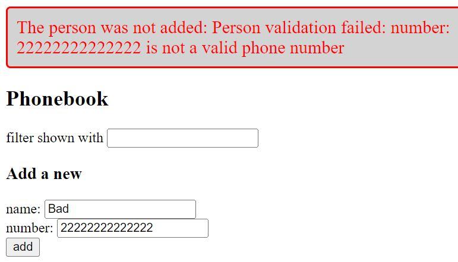

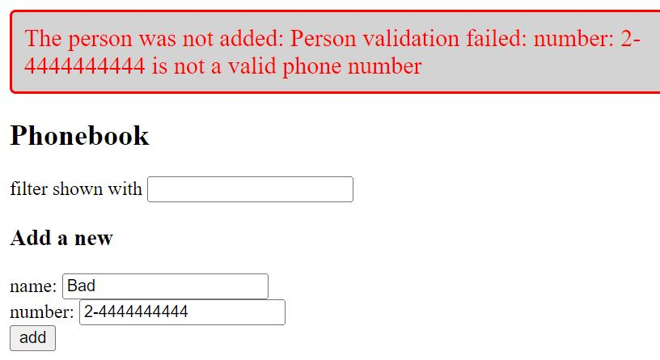 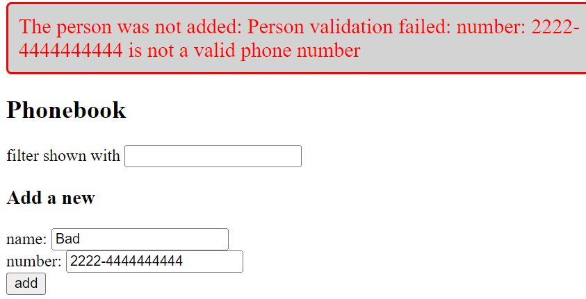

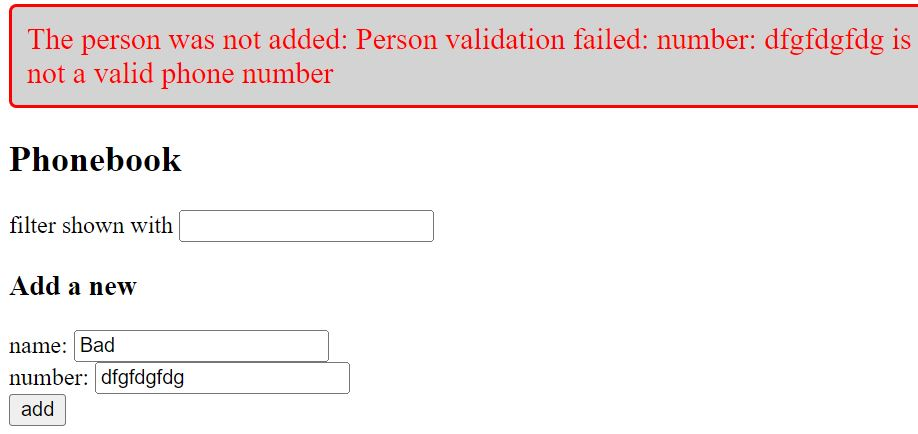

### Update a person who was just deleted

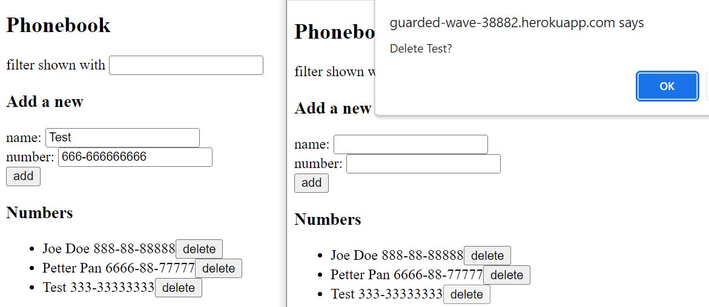

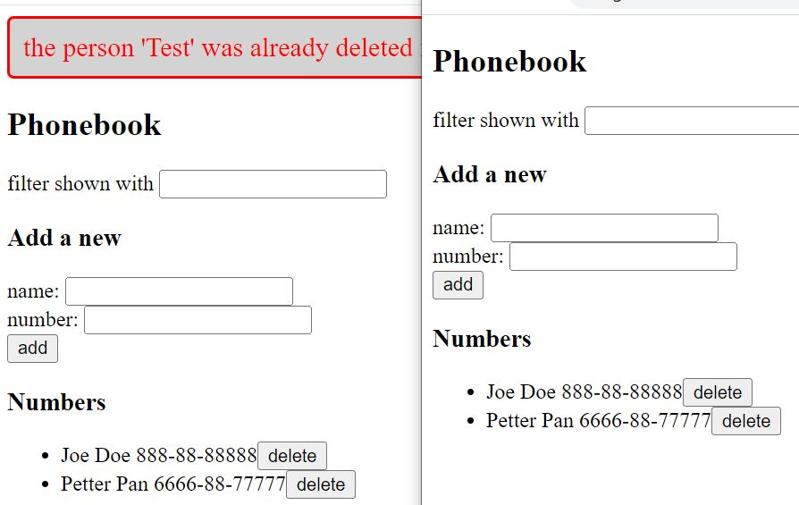

## Others
### Debugging
Different ways to debug: 
1) Console log
2) Visual Studio Code debugger: See Debugging in VS Code: https://code.visualstudio.com/docs/editor/debugging
  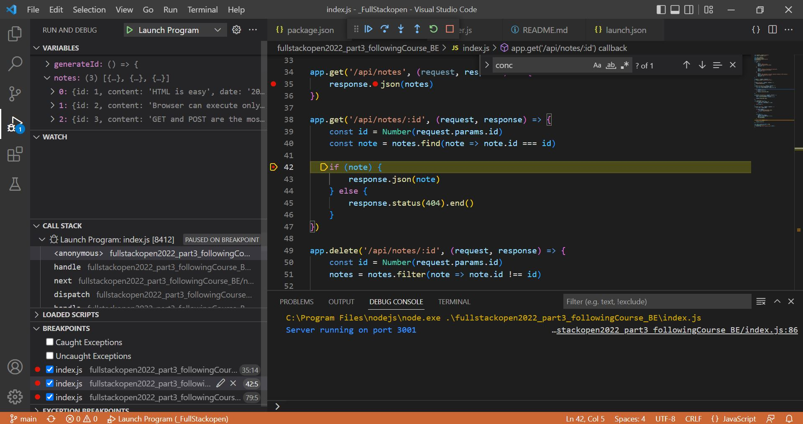
4) Chrome dev tools: by starting your application with the command: node --inspect index.js 
  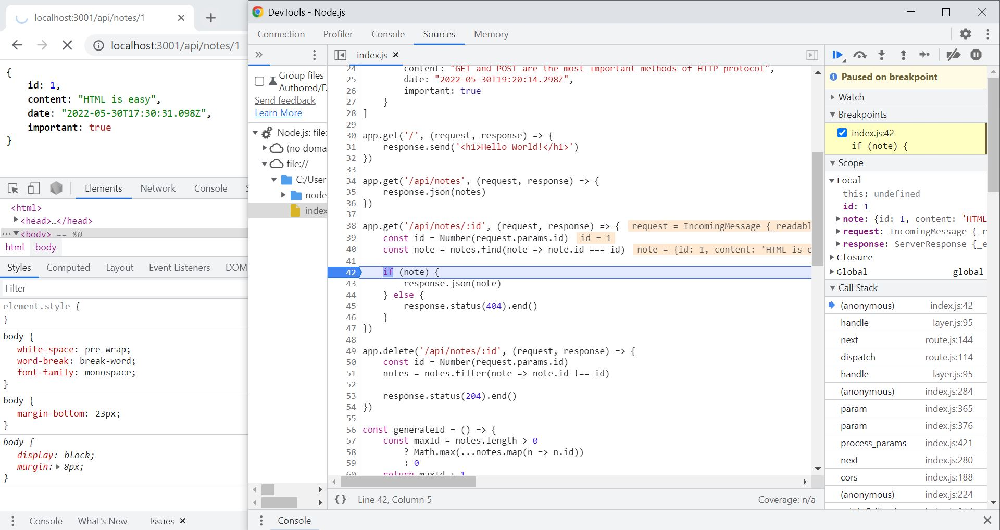
